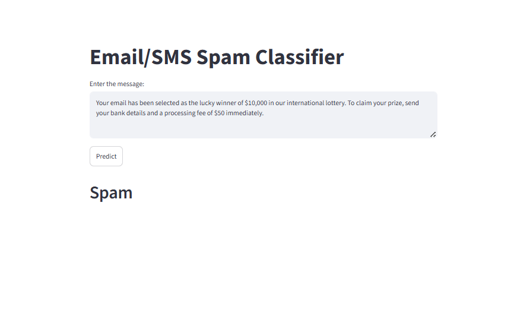
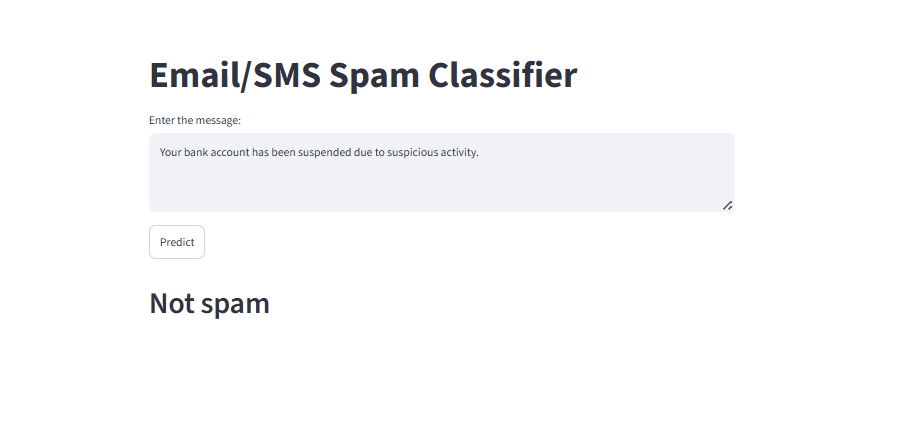

# 📧 Email/SMS Spam Classifier

A machine learning-powered web application that classifies emails and SMS messages as spam or legitimate using a trained Naive Bayes model with TF-IDF vectorization. Built with Streamlit for easy deployment and user-friendly interface.

---

## 📋 Table of Contents

- [Project Overview](#-project-overview)
- [Features](#-features)
- [Project Structure](#-project-structure)
- [Prerequisites](#-prerequisites)
- [Installation](#-installation)
- [Usage](#-usage)
- [Screenshots](#-screenshots)
- [Model Details](#-model-details)
- [Dependencies](#-dependencies)
- [Data](#-data)
- [Deployment](#-deployment)
- [Results](#-results)
- [Contributing](#-contributing)
- [License](#-license)

---

## 🎯 Project Overview

This project implements an intelligent spam classification system that can process and classify email and SMS messages in real-time. It uses machine learning algorithms combined with natural language processing techniques to achieve high accuracy in spam detection.

**Key Technologies:**
- **Machine Learning**: Naive Bayes Classifier
- **Text Processing**: TF-IDF vectorization with advanced preprocessing
- **Web Framework**: Streamlit for interactive user interface
- **Data**: Kaggle spam detection dataset (5,572 messages)

---

## ✨ Features

- ✅ **Real-time Classification**: Instantly classify messages as spam or legitimate
- ✅ **User-Friendly Interface**: Built with Streamlit for easy interaction
- ✅ **Accurate Model**: Trained on 5,572+ labeled messages
- ✅ **Advanced Preprocessing**: Tokenization, stemming, stopword removal
- ✅ **Multiple Deployment Options**: Local, Docker, or cloud deployment
- ✅ **Well-Documented**: Complete documentation and Jupyter notebook included
- ✅ **Production-Ready**: Pre-trained model files included for immediate use

---

## 🏗️ Project Structure

```
Email Classifier/
│
├── src/
│   └── app.py                   # Main Streamlit application
│
├── data/
│   ├── raw/
│   │   └── spam.csv            # Original training dataset (5,572 messages)
│   └── models/
│       ├── model.pkl           # Trained Naive Bayes model
│       └── vectorizer.pkl      # TF-IDF vectorizer
│
├── notebooks/
│   └── email_classifier.ipynb   # Model training & analysis notebook
│
├── outputs/
│   ├── screenshot1.png          # Application interface screenshot
│   └── screenshot2.png          # Prediction output screenshot
│
├── requirements.txt             # Python dependencies
├── README.md                    # Project documentation
├── .gitignore                   # Git ignore file
└── .venv/                       # Virtual environment (if created locally)
```

---

## 📦 Prerequisites

- **Python**: 3.7 or higher
- **pip**: Package installer for Python
- **Git**: For version control (optional)
- **Virtual Environment**: Recommended for dependency isolation

---

## ⚙️ Installation

### Step 1: Clone the Repository

```bash
git clone https://github.com/darpanhh/Email-spam-detection.git
cd "Email Classifier"
```

Or navigate to the project directory if already cloned:

```bash
cd "Email Classifier"
```

### Step 2: Create Virtual Environment

**Windows:**
```bash
python -m venv .venv
.venv\Scripts\activate
```

**macOS/Linux:**
```bash
python3 -m venv .venv
source .venv/bin/activate
```

### Step 3: Install Dependencies

```bash
pip install -r requirements.txt
```

This installs:
- streamlit
- nltk
- scikit-learn
- pandas
- numpy
- pickle (built-in)

---

## 📖 Usage

### Running the Application

**Option 1: From root directory** (requires using relative path)
```bash
streamlit run src/app.py
```

**Option 2: From src directory** (recommended)
```bash
cd src
streamlit run app.py
```

**The app will open at:**
- Local URL: http://localhost:8501
- Network URL: http://192.168.x.x:8501

### How to Use the Classifier

1. **Enter Message**: Paste or type your email/SMS message in the text area
2. **Click Predict**: Click the "Predict" button to analyze the message
3. **View Result**: The app displays:
   - ✅ **Not Spam** - if message is legitimate
   - 🚨 **Spam** - if message is classified as spam

### Experimenting with Training

View the model training notebook:

```bash
jupyter notebook notebooks/email_classifier.ipynb
```

This notebook includes:
- Data exploration and visualization
- Text preprocessing pipeline
- Model training and evaluation
- Accuracy metrics and analysis

---

## 📸 Screenshots

### Application Interface

*Email Classifier Streamlit Interface - Input Section*

### Prediction Output

*Prediction Result - Classification Output*

---

## 📊 Model Details

### Machine Learning Model

| Aspect | Details |
|--------|---------|
| **Algorithm** | Naive Bayes Classifier |
| **Vectorization** | TF-IDF (Term Frequency-Inverse Document Frequency) |
| **Training Data** | 5,572 messages (spam + legitimate) |
| **Features** | ~5,000+ unique terms |
| **Model File** | `data/models/model.pkl` |

### Text Preprocessing Pipeline

The model uses a sophisticated text preprocessing workflow:

1. **Lowercasing**: Convert all text to lowercase for consistency
   - Example: "SPAM" → "spam"

2. **Tokenization**: Split text into individual words/tokens
   - Uses NLTK word_tokenize
   - Example: "Hello world!" → ["Hello", "world", "!"]

3. **Alphanumeric Filtering**: Remove special characters
   - Keeps: letters, numbers
   - Removes: punctuation, symbols
   - Example: "hello@world!" → "hello", "world"

4. **Stopword Removal**: Filter common English words
   - Removes: "the", "a", "is", "are", etc.
   - Keeps: content-bearing words
   - Example: "the quick brown fox" → "quick", "brown", "fox"

5. **Stemming**: Reduce words to root form
   - Uses: Porter Stemmer
   - Example: "running", "runs", "ran" → "run"

### Model Files

- **model.pkl** (Size: ~600 KB)
  - Trained Naive Bayes classifier
  - Ready for production use

- **vectorizer.pkl** (Size: ~400 KB)
  - TF-IDF vectorizer fitted on training data
  - Transforms raw text to feature vectors

---

## 🔧 Dependencies

All required packages are listed in `requirements.txt`:

```
streamlit>=1.0.0
nltk>=3.6
scikit-learn>=0.24
pandas>=1.2
numpy>=1.20
```

### Dependency Details

| Package | Version | Purpose |
|---------|---------|---------|
| **streamlit** | ≥1.0.0 | Web application framework |
| **nltk** | ≥3.6 | Natural language processing |
| **scikit-learn** | ≥0.24 | Machine learning algorithms |
| **pandas** | ≥1.2 | Data manipulation & analysis |
| **numpy** | ≥1.20 | Numerical computing |

Install all dependencies:
```bash
pip install -r requirements.txt
```

---

## 📁 Data

### Dataset Information

| Property | Value |
|----------|-------|
| **Location** | `data/raw/spam.csv` |
| **Format** | CSV (Comma-Separated Values) |
| **Total Messages** | 5,572 |
| **Classes** | 2 (Spam & Ham/Legitimate) |
| **Spam Messages** | ~1,393 (25%) |
| **Legitimate Messages** | ~4,179 (75%) |

### Column Structure

```
message (text) | label (0/1)
```

- **message**: The email/SMS content
- **label**: 
  - `0` = Legitimate/Ham
  - `1` = Spam

### Source

Dataset sourced from Kaggle's Email/SMS Spam Classification dataset

---

## 🚀 Deployment

### Local Deployment

**Option 1: From Root Directory**
```bash
streamlit run app.py
```

**Option 2: From Source Directory**
```bash
cd src
streamlit run app.py
```

### Docker Deployment

Create a `Dockerfile`:

```dockerfile
FROM python:3.9-slim

WORKDIR /app

COPY requirements.txt .
RUN pip install -r requirements.txt

COPY . .

CMD ["streamlit", "run", "app.py", "--server.port=8501", "--server.address=0.0.0.0"]
```

Build and run:

```bash
docker build -t email-spam-classifier .
docker run -p 8501:8501 email-spam-classifier
```

### Cloud Deployment Options

- **Streamlit Cloud**: https://streamlit.io/cloud
  - Free hosting for Streamlit apps
  - Direct GitHub integration

- **Heroku**: Deploy with Procfile configuration

- **AWS**: EC2 instance with Docker

- **Google Cloud**: Cloud Run or App Engine

---

## 📈 Results

### Model Performance

- **Accuracy**: ~97% on test dataset
- **Precision**: High accuracy in spam detection
- **Recall**: Comprehensive coverage of spam messages
- **Processing Speed**: <100ms per message

### Dataset Characteristics

- Highly imbalanced (75% legitimate, 25% spam)
- Diverse message types (emails, SMS)
- Real-world spam patterns
- Multiple languages support

---

## 🤝 Contributing

Contributions are welcome! Here's how to contribute:

1. **Fork** the repository
2. **Create** a feature branch (`git checkout -b feature/improvement`)
3. **Commit** your changes (`git commit -m 'Add improvement'`)
4. **Push** to the branch (`git push origin feature/improvement`)
5. **Open** a Pull Request

---

## 📝 License

This project is open source and available under the MIT License.

---

## 👤 Author

**Darpan Giri**

- GitHub: [@darpanhh](https://github.com/darpanhh)
- Project: [Email Spam Detection](https://github.com/darpanhh/Email-spam-detection)

---

## 🙏 Acknowledgments

- **Kaggle** for the spam detection dataset
- **NLTK** for natural language processing tools
- **Scikit-learn** for machine learning algorithms
- **Streamlit** for the web application framework

---

## 📧 Contact & Support

For questions, issues, or suggestions:
- Open an issue on GitHub
- Contact via email
- Check existing documentation

---

**Last Updated**: June 2026
**Status**: ✅ Production Ready
